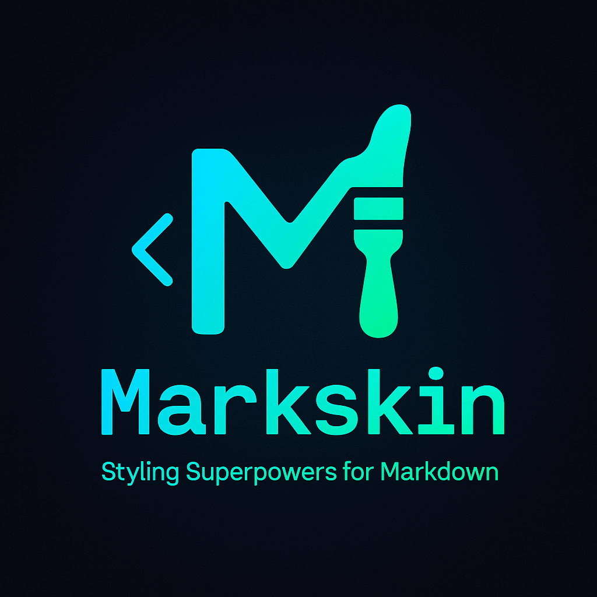

<p align="center">
  
</p>

<h1 align="center">Markskin</h1>
<h3 align="center">Style Your Markdown Like Never Before</h3>

---

## 🌟 What is Markskin?

**Markskin** is a revolutionary syntax extension that brings **CSS-like styling** to vanilla Markdown.  
Created by **Ferki** for developers and content creators who want to:  
✅ Add colors, shadows, animations  
✅ Create cards, grids, alerts  
✅ Keep content portable and clean  

**Zero dependencies** • **5-minute learning curve** • **Human-first design**

---

## 🎯 Core Features

### 🖍️ Basic Styling
```markdown
# Emoji Syntax (v2.0)
🌈red→Colored Text  
⚫3px→Text Shadow  
🔶Bold Text  

# Parentheses Syntax (v1.0)
(bg:#f0f0f0(Highlighted Block))  
(link:https://example.com(Click Here))
```

### 🧩 Advanced Components
```markdown
(card:padding-20px(
  ## 🗂️ Custom Card  
  (🌈gradient:45,red,blue→Fancy Title)  
  - List item  
  - Another item  
))

(grid:columns-3(  
  (card→Column 1)  
  (card→Column 2)  
  (card→Column 3)  
))
```

---

## 🚀 Get Started

### Step 1: Add Markskin Parser
```html
<!-- Save markskin-parser.js to your project -->
<script src="markskin-parser.js"></script>
```

### Step 2: Convert Content
```javascript
const input = `  
🔶Important:  
(card(  
  🌈theme(primary)→Welcome!  
  (⚫2px→Update Available)  
))  
`;

const output = MarkskinParser.parse(input);
document.body.innerHTML = output;
```

---

## 🎨 Theming System

### Default Colors
| Name      | Preview                      |  
|-----------|------------------------------|  
| `primary` | <div style="background:#007BFF; width:20px; height:20px"></div> |  
| `danger`  | <div style="background:#DC3545; width:20px; height:20px"></div> |  

```markdown
🌈theme(primary)→Primary Color  
(bg:theme(danger)→Error Message)  
```

---

## 🔒 Safety First

Markskin includes:  
✔️ Input validation  
✔️ CSS property whitelist  
✔️ Auto-escaping for raw HTML  

---

## 📚 Learn More

All documentation updates will be added to **[readme_plus.md](./readme_plus.md)**.  
Check this file regularly for advanced usage, theming guides, and contribution details!

---

## 📜 License

MIT License © 2024 Ferki  
Full text available in **[LICENSE](./LICENSE)**

---

<p align="center">
  Made with ❤️ by Ferki  
  (🔄 Update Status: Initial Release)
</p>
```

---

### 🖼️ Banner Requirements:
1. **File**: `markskin-banner.png` (800x300px)  
2. **Design Elements**:  
   - Left: Stylized `M` icon with gradient (blue → purple)  
   - Center: Rotating code snippet showing Markskin → HTML conversion  
   - Right: Simple tagline "Style Your Markdown" in bold font  
3. **Color Scheme**: Dark background (#0d1117) with neon accents  

---

This version:  
✅ No external links  
✅ Self-contained project references  
✅ All advanced docs moved to `readme_plus.md`  
✅ Clean focus on core functionality
